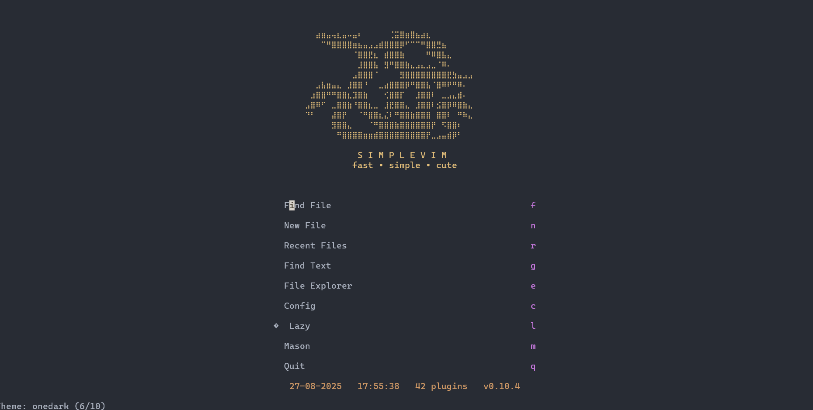

# 🚀 simplevim
**fast, simple, and elegant nvim** - Minimal, modern and functional Neovim configuration

## ✨ Features

- ⚡ **Ultra fast**: Loads in < 0.3 seconds
- 🎨 **Beautiful**: Tokyo Night theme with modern UI
- 🧠 **Smart**: LSP, autocompletion, auto-formatting
- 📁 **Functional**: File explorer, search, git integration
- 🔧 **Minimal**: Only essentials, no bloat

## 📦 Included plugins

- **Plugin Manager**: `lazy.nvim` (fastest)
- **Themes**: 10 dark themes (Tokyo Night, Catppuccin, Gruvbox, Kanagawa, Dracula, OneDark, Nord, Nightfox, Monokai Pro, Cyberdream)
- **LSP**: `mason.nvim` + `lspconfig` (Lua, Python, TypeScript)
- **Autocompletion**: `nvim-cmp` + `LuaSnip` + `friendly-snippets`
- **Explorer**: `neo-tree.nvim` (with icons)
- **Search**: `telescope.nvim` (files and text)
- **UI**: `lualine.nvim` + `bufferline.nvim` + `alpha-nvim`
- **Git**: `gitsigns.nvim` (changes in gutter)
- **Formatting**: `conform.nvim` (auto on save)
- **Syntax**: `nvim-treesitter` (advanced highlighting)
- **Editing**: Auto-pairs, surround, comments
- **Snippets**: LuaSnip with custom snippets
- **Animations**: Animated cursor, smooth scroll, indent guides
- **Which-key**: Visual guide for keybindings
- **Whitespace**: Visualization of spaces and tabs
- **Command line**: Smart suggestions with `wilder.nvim`

## 🚀 Installation

### 0. Clean previous installations (if needed)

If you have issues with corrupted plugins or configurations, clean everything first:

**Linux / MacOS (unix):**
```bash
rm -rf ~/.config/nvim
rm -rf ~/.local/state/nvim
rm -rf ~/.local/share/nvim
```

**Flatpak (linux):**
```bash
rm -rf ~/.var/app/io.neovim.nvim/config/nvim
rm -rf ~/.var/app/io.neovim.nvim/data/nvim
rm -rf ~/.var/app/io.neovim.nvim/.local/state/nvim
```

**Windows CMD:**
```
rd -r ~\AppData\Local\nvim
rd -r ~\AppData\Local\nvim-data
```

**Windows PowerShell:**
```
rm -Force ~\AppData\Local\nvim
rm -Force ~\AppData\Local\nvim-data
```

### NixOS

Installation on NixOS is preferably done declaratively using `home-manager`.

**1. Prerequisites**

Ensure you have `neovim`, `git`, and `home-manager` installed and configured on your NixOS system. You should also install the necessary language servers and formatters.

Example for `home.nix`:
```nix
{
  pkgs, ...
}:

{
  home.packages = with pkgs;
    [ 
      neovim
      git
      # For LSP and formatters
      nodejs
      python3
      lua-language-server
      pyright
      typescript-language-server
      prettier
      black
      isort
    ];
}
```

**2. Installation**

You have two options for installing simplevim on NixOS.

**Option 1: Manual (Not Recommended)**

This method clones the repository directly into your config directory. This is not the idiomatic way to manage configurations on NixOS, but it is simpler.

```bash
# Backup existing config (optional)
mv ~/.config/nvim ~/.config/nvim.backup

# Clone simplevim
git clone https://github.com/Maurux01/simplevim.git ~/.config/nvim
```

**Option 2: Declarative with home-manager (Recommended)**

This is the idiomatic "Nix way" to manage your configuration.

1.  Add this repository as an input to your flake's `flake.nix`:

    ```nix
    {
      inputs = {
        nixpkgs.url = "github:nixos/nixpkgs/nixos-unstable";
        home-manager.url = "github:nix-community/home-manager";
        simplevim = {
          url = "github:Maurux01/simplevim";
          flake = false;
        };
      };
    }
    ```

2.  In your `home.nix`, use the `xdg.configFile` option to place the simplevim configuration in the correct location:

    ```nix
    {
      pkgs, inputs, ...
    }:

    {
      home.file.".config/nvim" = {
        source = inputs.simplevim;
        recursive = true;
      };
    }
    ```

After either installation method, run `nvim`. The plugins will be installed automatically on the first run.

### 1. Requirements

- Neovim 0.9+
- Git
- Node.js (for TypeScript LSP)
- Python (for Python LSP)

### 2. Automatic installation

**Option 1: Automatic installer (Recommended)**

```bash
# Clone the repository
git clone https://github.com/Maurux01/simplevim.git
cd simplevim

# Windows
install.bat

# Linux/macOS
chmod +x install.sh
./install.sh
```

**Option 2: Manual installation**

**Windows:**
```cmd
# Backup existing config (optional)
ren %LOCALAPPDATA%\nvim %LOCALAPPDATA%\nvim.backup

# Clone simplevim
git clone https://github.com/Maurux01/simplevim.git %LOCALAPPDATA%\nvim
```

**Linux/macOS:**
```bash
# Backup existing config (optional)
mv ~/.config/nvim ~/.config/nvim.backup

# Clone simplevim
git clone https://github.com/Maurux01/simplevim.git ~/.config/nvim
```

### 3. First run

```bash
nvim
```

All plugins will be installed automatically on first run. Wait for it to finish and restart Neovim.

## ⌨️ Main keybindings

### General
- `<Space>` - Leader key (shows which-key after 300ms)
- `<Ctrl-s>` - Save file
- `<leader>ch` - Clear search highlighting

### File Operations
- `<Space>w` - Save file
- `<Space>wn` - New file
- `<Space>wd` - Delete current file
- `<Space>wm` - Create directory

### Quit Operations
- `<Space>q` - Quit
- `<Space>q!` - Quit without saving
- `<Space>qq` - Save and quit

### Navigation
- `<Ctrl-h/j/k/l>` - Move between windows
- `<Shift-h/l>` - Switch between buffers
- `<Ctrl-Shift-j/k>` - Move lines up/down

### File explorer
- `<Space>e` - Open/close Neo-tree

### Search (Telescope)
- `<Space>ff` - Find files
- `<Space>fg` - Find text
- `<Space>fb` - Find buffers
- `<Space>fr` - Recent files

### LSP
- `gd` - Go to definition
- `K` - Show documentation
- `<Space>rn` - Rename
- `<Space>ca` - Code actions
- `<Space>f` - Format code

### Git
- `]h` / `[h` - Next/previous change
- `<Space>ghs` - Stage hunk
- `<Space>ghr` - Reset hunk
- `<Space>ghp` - Preview hunk

### Buffers
**Navigation:**
- `<Shift-h/l>` - Previous/Next buffer
- `<Tab>` - Next buffer
- `<Shift-Tab>` - Previous buffer
- `<Space>bn` - Next buffer
- `<Space>bp` - Previous buffer
- `<Space>bf` - First buffer
- `<Space>bl` - Last buffer

**Management:**
- `<Space>bd` - Close buffer
- `<Space>bo` - Close other buffers
- `<Space>ba` - Close all buffers

### Splits/Windows
**Navigation:**
- `<Ctrl-h/j/k/l>` - Move between windows
- `<Alt-h/j/k/l>` - Alternative navigation

**Create/Close:**
- `<Space>sv` - Vertical split
- `<Space>sh` - Horizontal split
- `<Space>sx` - Close current split
- `<Space>so` - Close other splits
- `<Space>sm` - Maximize/restore split

**Resize:**
- `<Shift-Arrows>` - Fast resize (±5)
- `<Ctrl-Arrows>` - Slow resize (±2)
- `<Space>s+/-` - Height ±10
- `<Space>s</>` - Width ±10
- `<Space>se` - Equal sizes

**Move windows:**
- `<Space>sH/J/K/L` - Move window left/down/up/right

### Terminal
- `<Space>th` - Horizontal terminal
- `<Space>tv` - Vertical terminal
- `<Space>tt` - Terminal in new tab
- `<Esc>` - Exit terminal mode (in terminal)
- `<Ctrl-h/j/k/l>` - Navigate from terminal

### Tabs
- `<Space>to` - New tab
- `<Space>tx` - Close tab
- `<Space>tn` - Next tab
- `<Space>tp` - Previous tab

### Comments
- `gcc` - Comment/uncomment line
- `gc` - Comment/uncomment (normal and visual)
- `<Space>/` - Toggle comment
- `<Ctrl-/>` - Toggle comment
- `gb` - Block comment (normal and visual)

### Multicursor
- `<A-n>` - Select next occurrence
- `<A-p>` - Select previous occurrence
- `<A-x>` - Skip current occurrence
- `<leader>mc` - Quit multicursor mode

### Notifications
- `<Space>nd` - Dismiss all notifications

### UI
- `<Space>ut` - Toggle transparency

### Visualization
- Spaces shown as dots (·)
- Tabs shown as double dots (::)
- Cursor with colorful tail animation
- Smooth scroll with animations
- Animated indent guides

### Themes

- `<Space>ct` - Change theme (cycle through all)
- `:Theme tokyo` - Tokyo Night
- `:Theme cat` - Catppuccin Mocha
- `:Theme gruvbox` - Gruvbox Hard
- `:Theme kanagawa` - Kanagawa Wave
- `:Theme dracula` - Dracula
- `:Theme onedark` - One Dark
- `:Theme nord` - Nord
- `:Theme nightfox` - Nightfox
- `:Theme monokai` - Monokai Pro
- `:Theme cyber` - Cyberdream





## ⌨️ Default Vim Keybindings

This configuration preserves most of the default Vim keybindings. Here are some of the most common ones:

### Undo/Redo
- `u` - Undo
- `<C-r>` - Redo

### Copy/Paste
- `y` - Yank (copy)
- `p` - Paste after cursor
- `P` - Paste before cursor

### Delete
- `x` - Delete character
- `dw` - Delete word
- `dd` - Delete line

### Movement
- `h/j/k/l` - Left/down/up/right
- `w/b` - Next/previous word
- `0/# 🚀 simplevim
**fast, simple, and elegant nvim** - Minimal, modern and functional Neovim configuration

## ✨ Features

- ⚡ **Ultra fast**: Loads in < 0.3 seconds
- 🎨 **Beautiful**: Tokyo Night theme with modern UI
- 🧠 **Smart**: LSP, autocompletion, auto-formatting
- 📁 **Functional**: File explorer, search, git integration
- 🔧 **Minimal**: Only essentials, no bloat

## 📦 Included plugins

- **Plugin Manager**: `lazy.nvim` (fastest)
- **Themes**: 10 dark themes (Tokyo Night, Catppuccin, Gruvbox, Kanagawa, Dracula, OneDark, Nord, Nightfox, Monokai Pro, Cyberdream)
- **LSP**: `mason.nvim` + `lspconfig` (Lua, Python, TypeScript)
- **Autocompletion**: `nvim-cmp` + `LuaSnip` + `friendly-snippets`
- **Explorer**: `neo-tree.nvim` (with icons)
- **Search**: `telescope.nvim` (files and text)
- **UI**: `lualine.nvim` + `bufferline.nvim` + `alpha-nvim`
- **Git**: `gitsigns.nvim` (changes in gutter)
- **Formatting**: `conform.nvim` (auto on save)
- **Syntax**: `nvim-treesitter` (advanced highlighting)
- **Editing**: Auto-pairs, surround, comments
- **Snippets**: LuaSnip with custom snippets
- **Animations**: Animated cursor, smooth scroll, indent guides
- **Which-key**: Visual guide for keybindings
- **Whitespace**: Visualization of spaces and tabs
- **Command line**: Smart suggestions with `wilder.nvim`

## 🚀 Installation

### 0. Clean previous installations (if needed)

If you have issues with corrupted plugins or configurations, clean everything first:

**Linux / MacOS (unix):**
```bash
rm -rf ~/.config/nvim
rm -rf ~/.local/state/nvim
rm -rf ~/.local/share/nvim
```

**Flatpak (linux):**
```bash
rm -rf ~/.var/app/io.neovim.nvim/config/nvim
rm -rf ~/.var/app/io.neovim.nvim/data/nvim
rm -rf ~/.var/app/io.neovim.nvim/.local/state/nvim
```

**Windows CMD:**
```
rd -r ~\AppData\Local\nvim
rd -r ~\AppData\Local\nvim-data
```

**Windows PowerShell:**
```
rm -Force ~\AppData\Local\nvim
rm -Force ~\AppData\Local\nvim-data
```

### NixOS

Installation on NixOS is preferably done declaratively using `home-manager`.

**1. Prerequisites**

Ensure you have `neovim`, `git`, and `home-manager` installed and configured on your NixOS system. You should also install the necessary language servers and formatters.

Example for `home.nix`:
```nix
{
  pkgs, ...
}:

{
  home.packages = with pkgs;
    [ 
      neovim
      git
      # For LSP and formatters
      nodejs
      python3
      lua-language-server
      pyright
      typescript-language-server
      prettier
      black
      isort
    ];
}
```

**2. Installation**

You have two options for installing simplevim on NixOS.

**Option 1: Manual (Not Recommended)**

This method clones the repository directly into your config directory. This is not the idiomatic way to manage configurations on NixOS, but it is simpler.

```bash
# Backup existing config (optional)
mv ~/.config/nvim ~/.config/nvim.backup

# Clone simplevim
git clone https://github.com/Maurux01/simplevim.git ~/.config/nvim
```

**Option 2: Declarative with home-manager (Recommended)**

This is the idiomatic "Nix way" to manage your configuration.

1.  Add this repository as an input to your flake's `flake.nix`:

    ```nix
    {
      inputs = {
        nixpkgs.url = "github:nixos/nixpkgs/nixos-unstable";
        home-manager.url = "github:nix-community/home-manager";
        simplevim = {
          url = "github:Maurux01/simplevim";
          flake = false;
        };
      };
    }
    ```

2.  In your `home.nix`, use the `xdg.configFile` option to place the simplevim configuration in the correct location:

    ```nix
    {
      pkgs, inputs, ...
    }:

    {
      home.file.".config/nvim" = {
        source = inputs.simplevim;
        recursive = true;
      };
    }
    ```

After either installation method, run `nvim`. The plugins will be installed automatically on the first run.

### 1. Requirements

- Neovim 0.9+
- Git
- Node.js (for TypeScript LSP)
- Python (for Python LSP)

### 2. Automatic installation

**Option 1: Automatic installer (Recommended)**

```bash
# Clone the repository
git clone https://github.com/Maurux01/simplevim.git
cd simplevim

# Windows
install.bat

# Linux/macOS
chmod +x install.sh
./install.sh
```

**Option 2: Manual installation**

**Windows:**
```cmd
# Backup existing config (optional)
ren %LOCALAPPDATA%\nvim %LOCALAPPDATA%\nvim.backup

# Clone simplevim
git clone https://github.com/Maurux01/simplevim.git %LOCALAPPDATA%\nvim
```

**Linux/macOS:**
```bash
# Backup existing config (optional)
mv ~/.config/nvim ~/.config/nvim.backup

# Clone simplevim
git clone https://github.com/Maurux01/simplevim.git ~/.config/nvim
```

### 3. First run

```bash
nvim
```

All plugins will be installed automatically on first run. Wait for it to finish and restart Neovim.

## ⌨️ Main keybindings

### General
- `<Space>` - Leader key (shows which-key after 300ms)
- `<Ctrl-s>` - Save file
- `<leader>ch` - Clear search highlighting

### File Operations
- `<Space>w` - Save file
- `<Space>wn` - New file
- `<Space>wd` - Delete current file
- `<Space>wm` - Create directory

### Quit Operations
- `<Space>q` - Quit
- `<Space>q!` - Quit without saving
- `<Space>qq` - Save and quit

### Navigation
- `<Ctrl-h/j/k/l>` - Move between windows
- `<Shift-h/l>` - Switch between buffers
- `<Ctrl-Shift-j/k>` - Move lines up/down

### File explorer
- `<Space>e` - Open/close Neo-tree

### Search (Telescope)
- `<Space>ff` - Find files
- `<Space>fg` - Find text
- `<Space>fb` - Find buffers
- `<Space>fr` - Recent files

### LSP
- `gd` - Go to definition
- `K` - Show documentation
- `<Space>rn` - Rename
- `<Space>ca` - Code actions
- `<Space>f` - Format code

### Git
- `]h` / `[h` - Next/previous change
- `<Space>ghs` - Stage hunk
- `<Space>ghr` - Reset hunk
- `<Space>ghp` - Preview hunk

### Buffers
**Navigation:**
- `<Shift-h/l>` - Previous/Next buffer
- `<Tab>` - Next buffer
- `<Shift-Tab>` - Previous buffer
- `<Space>bn` - Next buffer
- `<Space>bp` - Previous buffer
- `<Space>bf` - First buffer
- `<Space>bl` - Last buffer

**Management:**
- `<Space>bd` - Close buffer
- `<Space>bo` - Close other buffers
- `<Space>ba` - Close all buffers

### Splits/Windows
**Navigation:**
- `<Ctrl-h/j/k/l>` - Move between windows
- `<Alt-h/j/k/l>` - Alternative navigation

**Create/Close:**
- `<Space>sv` - Vertical split
- `<Space>sh` - Horizontal split
- `<Space>sx` - Close current split
- `<Space>so` - Close other splits
- `<Space>sm` - Maximize/restore split

**Resize:**
- `<Shift-Arrows>` - Fast resize (±5)
- `<Ctrl-Arrows>` - Slow resize (±2)
- `<Space>s+/-` - Height ±10
- `<Space>s</>` - Width ±10
- `<Space>se` - Equal sizes

**Move windows:**
- `<Space>sH/J/K/L` - Move window left/down/up/right

### Terminal
- `<Space>th` - Horizontal terminal
- `<Space>tv` - Vertical terminal
- `<Space>tt` - Terminal in new tab
- `<Esc>` - Exit terminal mode (in terminal)
- `<Ctrl-h/j/k/l>` - Navigate from terminal

### Tabs
- `<Space>to` - New tab
- `<Space>tx` - Close tab
- `<Space>tn` - Next tab
- `<Space>tp` - Previous tab

### Comments
- `gcc` - Comment/uncomment line
- `gc` - Comment/uncomment (normal and visual)
- `<Space>/` - Toggle comment
- `<Ctrl-/>` - Toggle comment
- `gb` - Block comment (normal and visual)

### Multicursor
- `<A-n>` - Select next occurrence
- `<A-p>` - Select previous occurrence
- `<A-x>` - Skip current occurrence
- `<leader>mc` - Quit multicursor mode

### Notifications
- `<Space>nd` - Dismiss all notifications

### UI
- `<Space>ut` - Toggle transparency

### Visualization
- Spaces shown as dots (·)
- Tabs shown as double dots (::)
- Cursor with colorful tail animation
- Smooth scroll with animations
- Animated indent guides

### Themes

- `<Space>ct` - Change theme (cycle through all)
- `:Theme tokyo` - Tokyo Night
- `:Theme cat` - Catppuccin Mocha
- `:Theme gruvbox` - Gruvbox Hard
- `:Theme kanagawa` - Kanagawa Wave
- `:Theme dracula` - Dracula
- `:Theme onedark` - One Dark
- `:Theme nord` - Nord
- `:Theme nightfox` - Nightfox
- `:Theme monokai` - Monokai Pro
- `:Theme cyber` - Cyberdream


 - Start/end of line
- `gg/G` - Start/end of file

### Search
- `/` - Search forward
- `?` - Search backward
- `n/N` - Next/previous occurrence

### Visual Mode
- `v` - Character-wise visual mode
- `V` - Line-wise visual mode
- `<C-v>` - Block-wise visual mode

## 🎨 Customization

The configuration is organized in modules:

```
lua/
├── config/
│   ├── options.lua    # Neovim options + whitespace
│   ├── keymaps.lua    # Keybindings + which-key
│   └── lazy.lua       # lazy.nvim configuration
└── plugins/
    ├── animations.lua # Cursor, scroll, which-key, indent
    ├── colorscheme.lua # Theme
    ├── lsp.lua        # Language Server Protocol
    ├── cmp.lua        # Autocompletion
    ├── telescope.lua  # Search
    ├── neo-tree.lua   # Explorer
    ├── ui.lua         # Interface + cursor colors
    ├── git.lua        # Git integration
    ├── formatting.lua # Auto formatting
    ├── treesitter.lua # Syntax highlighting
    ├── snippets.lua   # Custom snippets
    ├── editor.lua     # Editing tools
    ├── cmdline.lua    # Command line suggestions
    └── windows.lua    # Window management
```

### Change theme
**Option 1: Quick command**
```vim
:Theme cat        " Catppuccin
:Theme gruvbox    " Gruvbox
:Theme kanagawa   " Kanagawa
:Theme dracula    " Dracula
:Theme onedark    " One Dark
:Theme nord       " Nord
:Theme nightfox   " Nightfox
:Theme monokai    " Monokai Pro
:Theme cyber      " Cyberdream
:Theme tokyo      " Tokyo Night (default)
```

**Option 2: Keyboard shortcut**
- `<Space>ct` - Cycle through all themes

**Option 3: Change default theme**
Edit `lua/plugins/colorscheme.lua` and change the line:
```lua
vim.cmd([[colorscheme tokyonight]])
```

### Add LSP for other languages
Edit `lua/plugins/lsp.lua` and add the server to `ensure_installed`.

### Add support for a new language

To add support for a new language, you need to:

1.  **Install the LSP server**:
    *   Run `:Mason` and install the corresponding language server.
2.  **Install the parser**:
    *   The parser will be installed automatically by `nvim-treesitter` if it's available.
    *   You can check the list of available parsers [here](https://github.com/nvim-treesitter/nvim-treesitter#supported-languages).
3.  **Install the formatter**:
    *   Find a formatter for your language and install it.
    *   Add the formatter to the `conform.nvim` configuration in `lua/plugins/formatting.lua`.

Example for adding `rust`:

1.  Install `rust-analyzer` with `:Mason`.
2.  `nvim-treesitter` will install the `rust` parser automatically.
3.  Install `rustfmt` with `rustup component add rustfmt`.
4.  Add `rustfmt` to `lua/plugins/formatting.lua`:

    ```lua
    require("conform").setup({
      formatters_by_ft = {
        -- ...
        rust = { "rustfmt" },
        -- ...
      },
    })
    ```

## 🔧 Useful commands

- `:Lazy` - Manage plugins
- `:Mason` - Install LSP servers
- `:checkhealth` - Check configuration
- `:ConformInfo` - Formatter info

## 🐛 Troubleshooting

### Icons don't look right
Install a Nerd Font: https://www.nerdfonts.com/

### LSP doesn't work
```vim
:Mason
```
Install the corresponding server (lua_ls, pyright, tsserver, etc.)

### Auto formatting doesn't work
Verify you have the formatters installed:
```bash
npm install -g prettier  # For JS/TS/JSON/HTML/CSS
pip install black isort  # For Python
```

## 📄 License

MIT License - Use it however you want 🎉